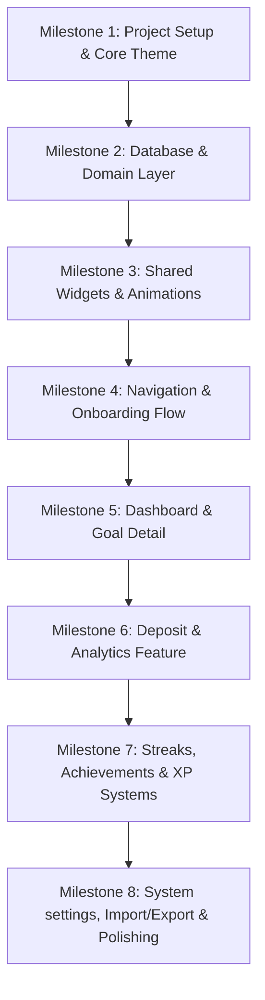

# Implementation Plan — PiggyVault (Скарбничка)

> [!IMPORTANT]
> **Phase 16: Dopamine Detox Mode & Haptic Heartbeat**
> We will implement psychological and behavioral triggers from Sprint 1 of our product roadmap to improve user discipline:
> 
> 1. **Dopamine Detox Mode**:
>    * Add settings keys `dopamine_detox_enabled` (bool) and `dopamine_detox_until` (timestamp) in `SettingsService`.
>    * Toggle and manual 24-hour trigger cycle option in `SettingsScreen`.
>    * Auto-triggers a 24h detox cycle when a penalty is active if `isDopamineDetoxEnabled` is true.
>    * Turns the entire application monochrome (grayscale filter) in `ShellScaffold` during active detox.
>    * Intercepts route navigation in `GoRouter` to redirect users away from customization, market, lootboxes, and skill-tree back to the dashboard, displaying a warning banner.
> 
> 2. **Haptic Heartbeat**:
>    * Create a custom double-pulse haptic vibration helper (heartbeat sensation).
>    * Trigger this haptic heartbeat when the user views the main balance on the Dashboard or opens a Goal Detail screen.
> 
> Please review and approve!

## User Review Required
- **Detox Trigger Behavior**: Do you want Dopamine Detox to also automatically trigger when the pet reactor core temperature enters the critical (>60°C) state?
- **Grayscale Filter Intensity**: Fully monochrome (0% color saturation) is proposed to starve the brain of visual reward triggers.

## Open Questions
- None.

---

## Proposed Folder & Package Structure

We will implement a clean architecture with a feature-driven folder organization:

```
lib/
├── core/
│   ├── constants/          # Colors, text sizes, strings (UA/EN), durations
│   ├── theme/              # Cyberpunk custom theme, typography, glows
│   ├── router/             # GoRouter setup, typed path parameters, transitions
│   ├── di/                 # Dependency injection registration (Riverpod)
│   ├── utils/              # Currency formatting, date calculations, haptics helper
│   └── database/           # Drift database file, table definitions, open_connection
├── features/
│   ├── onboarding/         # Welcome, Goal A setup, Goal B setup, Currency, Ready
│   ├── dashboard/          # Home, combined progress, active streak banner
│   ├── deposit/            # Amount keypads, allocation slider, confirms, successes
│   ├── goals/              # Goal details, chart projections, edit goals, completions
│   ├── achievements/       # Badges grid, details modal, unlock animations queue
│   ├── streaks/            # Fire room custom paint flame, freeze tokens, heatmap
│   ├── analytics/          # Weekly bar chart, donut charts, statistics
│   ├── settings/           # Profile, notification toggles, sound/haptic settings
│   └── shared/             # Feature-specific shared utilities
├── shared/
│   ├── widgets/            # GlassCard, NeonProgressBar, DualProgressRing, ParticleBackground, NeonButton
│   ├── animations/         # Custom animation wrappers, pulsing, typewriter, floaters
│   └── extensions/         # Context styling extensions, currency formatting, glow effects
└── main.dart               # App entrypoint with Impeller verification comments
```

---

## Core Components & Proposed Implementation

### 1. Database Schema (Drift Definition)
The database will contain the following tables in `lib/core/database/database.dart`:
- **`Goals`**: 
  - `id` (Text, Primary Key)
  - `label` (Text)
  - `targetAmount` (Real)
  - `currentAmount` (Real)
  - `deadline` (DateTime, Nullable)
  - `colorHex` (Text)
  - `iconKey` (Text)
- **`Deposits`**:
  - `id` (Int, AutoIncrement)
  - `amount` (Real)
  - `goalId` (Text, Foreign Key references Goals.id)
  - `note` (Text, Nullable, max 100 chars)
  - `createdAt` (DateTime)
  - `type` (Text) — 'manual', 'scheduled', 'imported'
- **`Achievements`**:
  - `id` (Text, Primary Key) — unique achievement key
  - `unlockedAt` (DateTime)
  - `isSeen` (Bool)
- **`Streaks`**:
  - `id` (Int, AutoIncrement)
  - `date` (DateTime, Unique)
  - `hasDeposit` (Bool)
  - `amount` (Real)
## Proposed Changes (Phase 15)

### 1. Global Glitch UI
We will expand the current "System Infected" glitch to affect the entire application UI if the user neglects their savings.
- **[MODIFY]** `lib/features/dashboard/screens/shell_scaffold.dart`: Wrap the main `child` in an animated Shader or Shake effect if the user's `penaltyBalance > 0` or if they haven't saved in >3 days.

### 2. AI Bounty Missions (Generative Quests)
Instead of static goals, the AI Coach will issue dynamic "Contracts".
- **[NEW]** `lib/features/gamification/models/bounty_model.dart`: Define a `Bounty` class (description, target amount, deadline, reward).
- **[NEW]** `lib/features/gamification/providers/bounty_provider.dart`: Fetches daily bounties using the `OpenRouterService`.
- **[MODIFY]** `lib/features/dashboard/screens/dashboard_screen.dart`: Add a "Daily Contract" widget below the AI Insights banner.

### 3. Incognito "Hacking" Mode (Matrix Cipher)
A quick gesture to scramble financial numbers into cyberpunk symbols.
- **[MODIFY]** `lib/features/dashboard/screens/dashboard_screen.dart`: Add a swipe-down gesture or a prominent "HACK MODE" toggle.
- **[NEW]** `lib/core/widgets/cipher_text.dart`: A widget that randomly animates characters (like The Matrix) when Privacy Mode is ON, instead of just showing `***`.

### 4. Audio Soundscape
We will integrate a lightweight audio player for UI sounds.
- **[MODIFY]** `pubspec.yaml`: Add `audioplayers` dependency.
- **[NEW]** `lib/core/services/audio_service.dart`: Manage background lo-fi synthwave (if provided) and button click sounds. *(Note: We will need actual MP3/WAV assets for this).*

## Verification Plan

### Automated Tests
- Run `flutter analyze` and `flutter test` to ensure new providers don't break existing logic.

### Manual Verification
1. **Glitch UI**: Accumulate a penalty and observe if the entire screen shakes/glitches.
2. **AI Bounties**: Check if the Daily Contract widget populates with an AI-generated quest.
3. **Cipher Text**: Toggle Privacy Mode and ensure balances scramble into matrix symbols.
  - `streakFreezeTokens` (Int)
  - `currentStreak` (Int)
  - `bestStreak` (Int)

### 2. State Management Design (Riverpod)
We will leverage Riverpod's code-generation (`riverpod_generator`) for state management:
- `goalsProvider`: `AsyncNotifierProvider` that handles reading/updating goal progress.
- `depositsProvider`: `StreamProvider` for real-time deposit lists.
- `streakProvider`: `NotifierProvider` tracking current streak, heatmap logs, and streak-freeze counts.
- `achievementsProvider`: `NotifierProvider` tracking locked/unlocked badges and triggering the celebration queue.
- `xpLevelProvider`: `NotifierProvider` that manages the user's level and XP thresholds.
- `settingsProvider`: `NotifierProvider` for localized language selection, master sound toggles, and notification settings.

### 3. Reusable Cyberpunk Widgets System
In `lib/shared/widgets/`, we will implement these highly polished components with custom drawing:
- `ParticleBackground`: A `CustomPainter`-based backdrop drawing floating neon sparks of cyan, magenta, and white that drift upward slowly at variable speeds, controlled by a single ticker to avoid CPU overhead.
- `GlassCard`: Frosted glass panel utilizing a `BackdropFilter` with `sigmaX: 12, sigmaY: 12`, a semi-transparent dark border (`borderAccent`), and a solid dark-navy shadow background.
- `NeonProgressBar`: A `CustomPainter` progress bar. Background track is dim cyan/magenta, while the progress track has a bright linear gradient, outer neon drop-shadow glow, and an animated glow head.
- `DualProgressRing`: Split-circle progress ring. The left half renders electric cyan progress, the right half renders magenta progress, meeting in a glowing center ring.
- `NeonButton`: Premium button with standard/disabled modes, a glowing animated neon stroke tracing its border, and haptic trigger integrations on tap.
- `AmountInputPad`: Fully custom digital keyboard for deposits with satisfying button key-taps and scale anims.
- `SplitSlider`: Linked slider for allocating deposits: cyan left, magenta right, dual-glowing center thumb.

### 4. Custom Animations Library (`lib/shared/animations/`)
- `GlowPulse`: Gently scale-pulses borders and glow shadows.
- `TypewriterText`: Renders numbers or labels character-by-character with neon flashes.
- `ConfettiCelebration`: Integrated wrapper around `confetti` packages with customized neon hues.
- `StreakFlame`: Custom-painted vector flame that rises and fluctuates dynamically with streak length.

---

## Detailed Step-by-Step Milestones



### Milestone 1: Project Setup & Cyberpunk Theme
- [ ] Initialize standard Flutter project (`com.piggyvault.app`).
- [ ] Setup `pubspec.yaml` with all dependencies (Riverpod, Drift, Hive, GoRouter, fl_chart, confetti, etc.).
- [ ] Define the complete design system in `lib/core/theme/` and `lib/core/constants/app_colors.dart` including color tokens, custom `Orbitron`, `Rajdhani`, and `Inter` typography models, glows, borders, and gradients.
- [ ] Add basic assets (fonts, custom SVGs for DualSense and curved monitor).

### Milestone 2: Relational Local Database & State layer
- [ ] Set up the Drift database in `lib/core/database/` with `Goals`, `Deposits`, `Achievements`, `Streaks`, and `UserStats` tables.
- [ ] Generate database helper classes (`database.g.dart`) via `build_runner`.
- [ ] Write repositories for core queries (inserts, progress aggregations, streak date validation, achievement conditions).
- [ ] Set up Riverpod data streams and provider classes.

### Milestone 3: Shared Design System Widgets
- [ ] Implement `ParticleBackground` using `CustomPainter` and double-buffer tickers.
- [ ] Implement `GlassCard` backdrop filters and borders.
- [ ] Implement `NeonProgressBar` with linear gradients and head-spark glow.
- [ ] Implement `DualProgressRing` split-arc painter.
- [ ] Implement `NeonButton` with glowing borders, presets, and haptic impact bindings.
- [ ] Implement `AmountInputPad` custom digital numeric keyboard.
- [ ] Implement `SplitSlider` dual linked slider.

### Milestone 4: Navigation Flow & Onboarding Setup
- [ ] Scaffold GoRouter with 20+ typed paths, nested shell routes, custom sliding transitions.
- [ ] Implement Screen 1.1 Splash Screen with 2.5-second cinematic laser grid scan and typing wordmark.
- [ ] Build Screen 1.2 Welcome Screen with breathing vault doors illustration and floating neons.
- [ ] Build Screen 1.3 Goal Setup Wizard for PS5 (cyan) and Monitor (magenta) including target picker presets and deadline select.
- [ ] Build Screen 1.4 Currency Select and Screen 1.5 Ready Screen showing vault cards materializing and firing confetti.

### Milestone 5: Dashboard Hub & Goal Details
- [ ] Implement Screen 2.1 Dashboard containing Avatar headers, streak banner pill, Vault Cards (loading, empty, active, complete states), combined progress ring, stats grids, and quick-mini history.
- [ ] Add empty states, streak warning indicators, and achievement overlays.
- [ ] Implement Screen 4.1 Goal Detail Screen with animated 360-degree icon entry, progress bar fill, milestone horizontal timeline nodes, and edit triggers.
- [ ] Implement Screen 4.4 Projections (fl_chart line graphs depicting past/future trajectories and on-track pacing states).
- [ ] Implement Screen 4.5 Goal Complete Screen (takeover explosion, looping neons, custom sound synthesizer hook).

### Milestone 6: Deposit flow & Analytics Engine
- [ ] Build Screen 3.1 Deposit Screen with large scale-snapping Orbitron typography, allocation modes (Goal A only, Goal B only, Split slider), and notes.
- [ ] Build Screen 3.2 Confirm Screen depicting current-to-projected dashed progress overlays.
- [ ] Build Screen 3.3 Deposit Success full-bleed card with heavy haptics, particle bursts, and unlock popups.
- [ ] Build Screen 3.5 Deposit History with swipe-to-delete cards, sections grouped by date, and Screen 3.6 Detail overlay.
- [ ] Build Screen 5.1 Analytics Dashboard containing dual-colored weekly stacked bar charts, donut asset composition indicators, and stats.
- [ ] Implement Screen 12.1 Search and Screen 12.2 Advanced filter bottom sheets.

### Milestone 7: Gamification Systems (Streaks, Badges, Leveling)
- [ ] Build Screen 10.1 Streak Fire Room containing reactive vector flame (rising/cooling based on streak length), milestones timeline, and freeze tokens stats.
- [ ] Build Screen 10.2 Streak Freezes log and Screen 5.2 GitHub-style 3-month activity heatmap.
- [ ] Build Screen 6.1 Achievements Trophy Room with 50+ list grids, locking system (grayscale + padlock overlays), rarity glows (Common, Rare, Epic, Legendary), and Screen 6.2 detailed badges.
- [ ] Build Screen 10.5 XP & Level Progress displaying concentric circular Level Badges, progress to next levels, and XP category breakdowns.
- [ ] Implement 10+ Daily Challenges (Screen 10.4) tracking specialized objectives.

### Milestone 8: Settings, Social Sharing & Quality Verification
- [ ] Implement Screen 7.1 Settings, Screen 7.2 granular local notifications scheduler, Screen 7.6 Avatar profile customizer, and Screen 7.5 Reset vault confirm text fields.
- [ ] Setup `RepaintBoundary` rendering system for Screen 13.1 and 13.2 to save/share gorgeous neon progress cards.
- [ ] Add master controls for granular haptic adjustments and digital sound synthesizer chimes (Screen 16.1).
- [ ] Write unit, widget, and integration tests ensuring 60 FPS, proper DB rollbacks, and offline capabilities.
- [ ] Localization file integrations (`intl_uk.arb` and `intl_en.arb`) covering all strings.

### Milestone 9: Phase 1 — Database & Architecture Expansion
- [ ] Upgrade Drift schema to `schemaVersion = 3`.
- [ ] Create `Lootboxes`, `Pets`, `Squads`, `SideQuests`, `TransactionTags`, `VoiceLogs`, `PenaltyHabits` tables.
- [ ] Update `UserProfiles` table: `skillPoints`, `playerClass`, `currentTheme`, `avatarConfig`, `penaltyBalance`.
- [ ] Write migration logic for seamless schema upgrade.

### Milestone 10: Phase 2 — Quality of Life (QoL)
- [ ] Implement `Swipe-to-Deposit` gesture on the Dashboard.
- [ ] Implement `Undo` window: 5-second delay before persisting deposit to DB.
- [ ] Implement `Dice Roll` randomizer on Deposit Screen.
- [ ] Implement `Change Calculator` math evaluation in the custom deposit keypad.

### Milestone 11: Phase 3 — Retention & Core Gamification
- [ ] Implement `Critical Deposit` (5% chance logic and special animation on success).
- [ ] Implement `Daily Spin` modal triggered on first app open of the day.
- [ ] Implement `Penalty Vault` mechanics (habit definition and fixed deductions).

### Milestone 12: Phase 4 — Cosmetics & RPG Systems
- [ ] Implement `Black Market` UI and theme engine toggling (Cyan/Magenta -> Custom colors).
- [ ] Implement `Avatar Builder` with unlockable items.
- [ ] Implement `Vault Pets` with feed logic based on deposits.
- [ ] Implement `Skill Tree` logic and XP points allocation.

### Milestone 13: Phase 5 — Social & Integrations
- [ ] Implement `Squads` basic UI (local mock or Firebase placeholder).
- [ ] Implement iOS/Android home screen interactive widgets for quick deposit.
- [ ] Implement Live Activities / Dynamic Island for "Dark Zone" mode.

### Milestone 15: Phase 7 — Open Banking & AI Smart Notifications
This phase introduces financial automation through transaction analysis.

**1. Banking Service Architecture (`banking_service.dart`)**
- Create models: `BankTransaction` (amount, title, category, date).
- Implement `MockBankingProvider` to generate a stream of realistic daily expenses (e.g., Groceries, Transport, Entertainment).

**2. Round-up Engine (`round_up_calculator.dart`)**
- Logic to calculate "change" to the nearest 10, 50, or 100 UAH.
- UI: A new tab/card on the Dashboard showing pending round-ups waiting to be deposited.

**3. AI Smart Insights Engine (`smart_insights_engine.dart`)**
- Pattern analyzer that compares recent spending vs historical averages.
- Generates actionable notifications: "Схоже, ти сьогодні витратив менше ніж зазвичай. Можливо, перекажеш зекономлені 50 грн у Сховище?".
- UI: A sleek cyberpunk dialog or dismissable banner that triggers these suggestions.

### Milestone 16: Phase 8 — OpenRouter Cyber-Coach (DeepSeek V4 Flash)
This phase upgrades the local AI Insights with a real LLM via OpenRouter. (COMPLETED)

### Milestone 17: Phase 9 — VAULT-17 (Smart Penalties & Avatar Evolution)
Fuses gamification with AI behavior enforcement. (COMPLETED)

### Milestone 18: Phase 10 — Cyber-Market (In-App Economy)
Introduces a spendable currency and a shop for cosmetic avatar upgrades. (COMPLETED)

### Milestone 19: Phase 11 — AI Personality Modules
Allows the user to customize the LLM's system prompt tone. (COMPLETED)

### Milestone 20: Phase 12 — Dynamic Cyber-Events
Creates an evolving world state where temporary events alter the economy. (COMPLETED)

### Milestone 21: Phase 13 — Anti-Goals (Blacklist)
Implements negative reinforcement for bad spending habits.

**1. Blacklist Logic**
- Create `BlacklistNotifier` to store user-defined bad categories.
- Create `BlacklistScreen` to manage categories.

**2. Auto-Penalty System**
- Intercept new transactions. If category matches blacklist, automatically invoke `PenaltyNotifier.issueFine`.

**3. Glitch/Virus Visuals**
- Update `DashboardScreen` and `AvatarWidget` to display a red glitch effect if there are unresolved blacklist penalties.

### Milestone 22: Phase 14 — Bounties & Terminal CLI
- Implement Terminal CLI (`TerminalScreen`) and `/save` command.
- Add AI-generated daily bounties (`BountyNotifier`).

### Milestone 23: Phase 15 — Skill Tree Integration ('Hacker', 'Magnate', 'Resilience')
We will revamp the gamification system to introduce three core growth mechanics rather than static classes.

**Proposed Changes:**
1. **Core Skills Definition:**
   - **Hacker**: Earned by using the Terminal CLI (`/save`), solving cipher mini-games, or using Incognito mode. **Perks**: Higher critical deposit chance, access to terminal easter eggs, bypass minor penalties.
   - **Magnate**: Earned by making large lump-sum deposits or achieving high target percentages. **Perks**: XP multipliers, cheaper Black Market items, passive streak points.
   - **Resilience**: Earned by maintaining long streaks, depositing after a missed day, or clearing penalty debts. **Perks**: Free streak freezes (Shields), reduced penalty costs.
2. **Database Update:** Add `hackerXp`, `magnateXp`, and `resilienceXp` to the `UserProfiles` table (or manage via JSON in `avatarConfig`).
3. **SavingsNotifier Integration:** Update the deposit logic to accept an `ActionContext` (e.g., `isCli`, `isRecovery`) to distribute specific skill XP alongside general XP.
4. **UI Revamp:** Redesign `SkillTreeScreen` (`skill_tree_screen.dart`) to display three interactive progress pillars (Hacker/Magnate/Resilience) with unlockable nodes at specific level thresholds.

---

## 🚀 Відкладені Ідеї та Побажання (User Wishlist Roadmap)

Ви надіслали чудовий список ідей для розширення нашого кіберпанк-всесвіту! Багато з них ідеально вписуються в концепцію. Ми збережемо їх тут для майбутніх фаз:

**🔥 Гейміфікація та мотивація**
- **Досягнення 3.0**: Конкретні нагороди (перші 100 грн, 30 днів стріку, 10 транзакцій поспіль, «Кібер-біржовий магнат»).
- **Пет-система**: Віртуальний кібер-пет (кібер-собака), який росте та кастомізується за депозити.
- **Лідерборди (Альянс)**: Таблиця лідерів серед друзів по накопиченням.

**📊 Аналітика та інсайти**
- **Категорії витрат**: Розбивка депозитів (заощадження, інвестиції, розваги).
- **Експорт даних**: PDF/CSV генерація історії транзакцій.
- **Місячний звіт**: Авто-згенерований підсумок місяця з графіками.

**🎨 Косметика та кастомізація**
- **Еволюція Аватара**: Кібер-аватар змінюється з ростом рівня.
- **Теми Інтерфейсу**: Матриця (зелена), Фіолетова неонова, Криваво-червона тощо.
- **Теплова карта активності 365 днів**: Як у GitHub, але на весь рік.

**🏪 Ринок та економіка**
- **Мультивалютність & Обмін**: Авто-конвертація UAH/USD/EUR за курсом.
- **Косметичні Скіни для Цілей**: Рамки для PS5/Монітора за кібер-кредити (CR).
- **Обмежені Події (Сезони)**: Кіберп'ятниця (х2 кредити), знижки на Чорному Ринку.
- **Аукціон Альянсу**: Торгівля рідкісними предметами.

**🛡️ Анти-штрафи та дисципліна**
- **Контракти з Наставником**: Друг контролює ваші штрафи.
- **Прогресивна система штрафів (Graduated Penalties)**: Більше пропусків = дорожчі штрафи.
- **Мультимодальні сповіщення**: Telegram/Email боти.

**🔧 Технічні покращення**
- **Віджети на робочий стіл**: iOS/Android віджети для стріку.
- **Хмарна синхронізація**: Збереження даних (Firebase / Supabase).
- **Голосовий ввід**: "Окей, Скарбничка, внеси 50 гривень...".
- **Світла тема (Day Mode)**: Адаптація кіберпанку для дня.

> [!IMPORTANT]
> **Питання до вас (Review Required):**
> У нас є два варіанти, куди рухатися далі:
> 1. Продовжити за планом **Фазу 15 (Дерево Навичок: Hacker/Magnate/Resilience)**.
> 2. Взяти якусь ідею з вашого нового списку і реалізувати її зараз (наприклад: *Прогресивні штрафи*, *Місячний звіт*, *Експорт у PDF*, або *Пет-систему*).
> 
> Що б ви хотіли побачити в наступному оновленні?

---

## Verification Plan

### Automated Tests
- Execute `flutter test` covering:
  - `GoalProgressCalculator` rounding, clamping, and completed flag updates.
  - `StreakCalculator` consecutive days gap testing and token usage triggers.
  - `ProjectionEngine` trend analysis regression logic.
- Execute widget tests covering `NeonProgressBar` custom paints and layout constraints.

### Manual Verification
- Deploy on iOS / Android simulator or device.
- Verify onboarding flow starts on fresh load and transitions to dashboard.
- Verify making manual deposits, custom split slider allocation, and streak updates.
- Verify achievements unlock instantly with haptic bursts and overlay cards.
- Verify full offline support by putting device in airplane mode, making transactions, and reviewing database persistence.
- Profile startup time and UI performance using Flutter DevTools (check for frame drops on particle background and custom flame animations).
