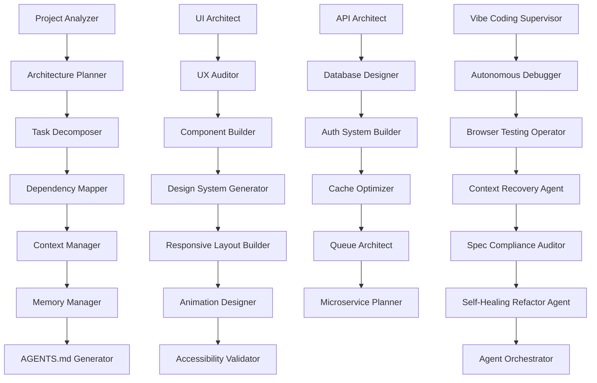
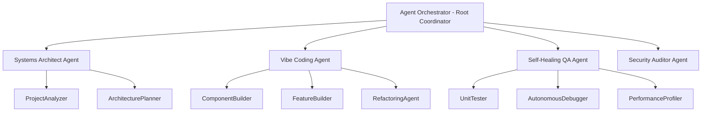
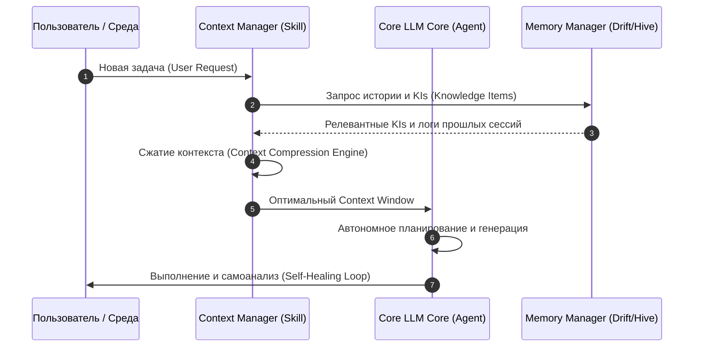
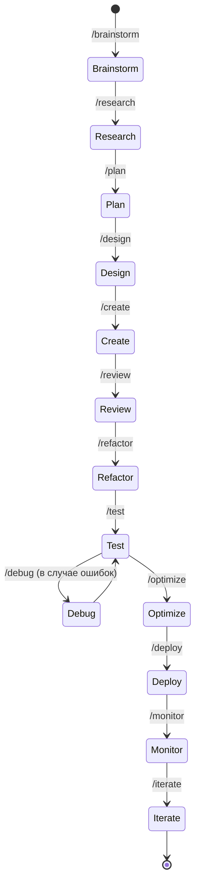

# ENTERPRISE AI AGENT SKILLS & WORKFLOWS LIBRARY (EDITION 2026)
## Спецификация и руководство для автономных мультиагентных систем проекта SaveQuest (PiggyVault)

---

> [!NOTE]  
> Данная библиотека представляет собой эталонный промышленный стандарт (State-of-the-Art) проектирования навыков, оркестрации контекста и автономного выполнения задач для AI-агентов нового поколения, интегрированных в экосистему **SaveQuest (PiggyVault)**.

---

## 1. АРХИТЕКТУРА И ПОТОКИ ДАННЫХ В 2026 ГОДУ

### 1.1 Граф зависимостей навыков (Skill Dependency Graph)
Каждый агент активирует навыки на основе топологической сортировки зависимостей.



### 1.2 Иерархия агентов (Agent Hierarchy)



### 1.3 Поток контекста (Context Flow Diagram)



### 1.4 Автономный жизненный цикл разработки (Autonomous Development Lifecycle)



---

## 2. КАТЕГОРИИ И СПЕЦИФИКАЦИИ НАВЫКОВ (SKILLS SPECIFICATION)

### CORE SYSTEM SKILLS

#### 2.1 Project Analyzer
*   **Purpose**: Глубокое семантическое сканирование кодовой базы проекта для построения полной ментальной карты (Flutter/Dart, Drift, Riverpod).
*   **When To Use**: Автоматически при первом запуске агента в незнакомой рабочей области или после крупных структурных мержей.
*   **Inputs**: Корневой путь проекта `d:\Скарбничка мрії\save_quest 2.0\save_quest`.
*   **Outputs**: JSON-структура со списком всех модулей, зависимостей, системных провайдеров и конфигураций.
*   **Execution Flow**:
    1. Рекурсивное чтение файлов `pubspec.yaml`, `lib/main.dart` и структуры каталогов.
    2. Анализ провайдеров Riverpod и Drift-таблиц.
    3. Создание графа импортов для выявления спагетти-кода.
*   **Validation Rules**: Выходной граф не должен иметь циклических ссылок или висящих узлов.
*   **Failure Recovery**: При неполном сканировании переключиться на пофайловое grep-сканирование ключевых файлов.
*   **Dependencies**: Context Manager, Dependency Mapper.

#### 2.2 Architecture Planner
*   **Purpose**: Проектирование архитектурного каркаса в соответствии с правилами Clean Architecture и Feature-First разработки.
*   **When To Use**: При создании новых системных фич (например, интеграция новой реляционной таблицы Drift или нового слоя API).
*   **Inputs**: Архитектурные требования, выводы Project Analyzer.
*   **Outputs**: Спецификация структуры каталогов и схемы потоков данных.
*   **Execution Flow**:
    1. Определение доменных сущностей (Domain Entities).
    2. Построение макетов Presentation, Domain и Data слоев.
    3. Спецификация DI провайдеров.
*   **Validation Rules**: Строгое соответствие правилу зависимости: Presentation -> Domain <- Data.
*   **Failure Recovery**: Откат к упрощенной BLoC/Notifier схеме при превышении сложности.
*   **Dependencies**: Project Analyzer, Task Decomposer.

#### 2.3 Task Decomposer
*   **Purpose**: Разделение комплексных бизнес-требований на мелкие атомарные таски для параллельного выполнения субагентами.
*   **When To Use**: После утверждения Implementation Plan для автоматической генерации файла `task.md`.
*   **Inputs**: Описание фичи, утвержденный архитектурный план.
*   **Outputs**: markdown-список атомарных задач в формате [ ] с указанием сложности.
*   **Execution Flow**:
    1. Анализ рисков и точек интеграции.
    2. Разбивка на фазы (База данных, Логика провайдеров, UI-компоненты, Тесты).
    3. Сохранение результатов в `task.md`.
*   **Validation Rules**: Каждая задача должна занимать не более 50 строк кода при реализации.
*   **Failure Recovery**: Автоматический мерж слишком мелких задач при обнаружении циклических блокировок.
*   **Dependencies**: Architecture Planner, Dependency Mapper.

#### 2.4 Dependency Mapper
*   **Purpose**: Картирование явных и неявных зависимостей между классами, методами и пакетами.
*   **When To Use**: Перед любым рефакторингом системного кода или обновлением пакетов в `pubspec.yaml`.
*   **Inputs**: Спецификация задачи, исходный код.
*   **Outputs**: Граф влияния изменений (Impact Analysis Graph).
*   **Execution Flow**:
    1. Построение AST-дерева модифицируемого файла.
    2. Определение мест использования экспортируемых символов.
    3. Сигнализация о потенциально затронутых тестах.
*   **Validation Rules**: Точность выявления затронутых модулей должна быть 100%.
*   **Failure Recovery**: Запуск глобального статического анализатора для проверки импортов.
*   **Dependencies**: Project Analyzer.

#### 2.5 Context Manager
*   **Purpose**: Управление контекстным окном LLM, очистка шума и предотвращение галлюцинаций из-за переполнения памяти.
*   **When To Use**: Перед каждой отправкой запроса к LLM или генерацией кода.
*   **Inputs**: Текущий стек изменений, история сессии, открытые документы.
*   **Outputs**: Сжатый, релевантный контекст для системного промпта.
*   **Execution Flow**:
    1. Фильтрация неиспользуемых файлов из логов.
    2. Замена длинных логов сборки сжатым описанием ошибок.
    3. Удаление дублирующихся Knowledge Items.
*   **Validation Rules**: Размер передаваемого текста не должен превышать 80% от лимита внимания модели.
*   **Failure Recovery**: Перезапуск сессии с очисткой кэша неактивных документов.
*   **Dependencies**: Memory Manager.

#### 2.6 Memory Manager
*   **Purpose**: Локальное кэширование и долгосрочное хранение решений, паттернов проектирования и пользовательских предпочтений.
*   **When To Use**: После успешного закрытия крупных задач или при переходе между рабочими процессами.
*   **Inputs**: Логи выполнения, код ревью, обратная связь пользователя.
*   **Outputs**: Обновленная папка `.system_generated/logs` и новые Knowledge Items.
*   **Execution Flow**:
    1. Индексация успешных паттернов отладки.
    2. Сохранение связей в локальную БД Vector Store / JSON.
    3. Очистка неактуальных кэш-файлов.
*   **Validation Rules**: Корректность структуры метаданных в Knowledge Items.
*   **Failure Recovery**: Восстановление из резервной копии кэша `.env` и `.qodo`.
*   **Dependencies**: Context Manager.

#### 2.7 AGENTS.md Generator
*   **Purpose**: Автоматическое документирование текущего состояния оркестрации агентов, их полномочий и используемых навыков.
*   **When To Use**: Каждые 24 часа автономной работы или при смене состава мультиагентной системы.
*   **Inputs**: Метаданные активных субагентов, текущая фаза проекта.
*   **Outputs**: Файл `AGENTS.md` в корневом каталоге.
*   **Execution Flow**:
    1. Сбор логов о сбоях субагентов.
    2. Документирование ролей и зон ответственности.
    3. Генерация сводной таблицы успеваемости.
*   **Validation Rules**: Отсутствие в файле устаревших ссылок на несуществующие инструменты.
*   **Failure Recovery**: Генерация стандартного шаблона агентов на базе `README.md`.
*   **Dependencies**: Project Analyzer, Memory Manager.

---

### FRONTEND SKILLS

#### 2.8 UI Architect
*   **Purpose**: Разработка архитектуры слоя отображения, интеграция с Impeller, выбор оптимальных виджетов для 120 FPS.
*   **When To Use**: Создание новых экранов или редизайн существующих (например, редизайн Dashboard под Glassmorphic стилистику).
*   **Inputs**: Дизайн-токены, требования к отзывчивости UI.
*   **Outputs**: Dart-файлы каркаса экранов с Impeller-оптимизациями.
*   **Execution Flow**:
    1. Спецификация слоев CustomPainter и BackdropFilter.
    2. Использование RepaintBoundary для изоляции перерисовывающихся неон-эффектов.
    3. Конфигурация анимационных контроллеров.
*   **Validation Rules**: 100% плавность переходов, отсутствие овердроу (overdraw).
*   **Failure Recovery**: Отключение сложных размытий при падении производительности ниже 60 FPS.
*   **Dependencies**: Design System Generator, Responsive Layout Builder.

#### 2.9 UX Auditor
*   **Purpose**: Анализ удобства использования интерфейса, проверка паттернов навигации и соответствия Apple HIG / Material 3.
*   **When To Use**: После завершения верстки новых экранов или создания интерактивных диалогов.
*   **Inputs**: Код виджетов, скриншоты экранов (через Browser/Pencil-инструменты).
*   **Outputs**: Отчет аудита юзабилити с перечнем узких мест.
*   **Execution Flow**:
    1. Подсчет количества шагов (кликов) для ключевых действий (например, внесение быстрого депозита).
    2. Проверка контрастности шрифтов на неон-подложках.
    3. Оценка интуитивности жестов (Swipe-to-Deposit).
*   **Validation Rules**: Отсутствие заблокированных состояний интерфейса без возможности возврата.
*   **Failure Recovery**: Автоматический откат к стандартным кнопкам вместо жестов при негативной валидации.
*   **Dependencies**: Accessibility Validator, UI Architect.

#### 2.10 Component Builder
*   **Purpose**: Сборка высокопроизводительных переиспользуемых виджетов (кнопки, карточки, слайдеры).
*   **When To Use**: При создании UI элементов по спецификации дизайн-системы.
*   **Inputs**: Входные параметры виджета (props), тема оформления.
*   **Outputs**: Dart-код виджета в папке `lib/shared/widgets/` или `lib/core/widgets/`.
*   **Execution Flow**:
    1. Написание Stateless/Stateful виджета с поддержкой реактивных тем.
    2. Интеграция тактильной обратной связи `HapticsHelper`.
    3. Покрытие виджет-тестами.
*   **Validation Rules**: Виджет не должен содержать жестко захардкоженных цветов или размеров.
*   **Failure Recovery**: Пересборка виджета на основе стандартного `Container` с плавным переходом.
*   **Dependencies**: UI Architect, Animation Designer.

#### 2.11 Design System Generator
*   **Purpose**: Создание единой системы токенов, градиентов, стилей текста и эффектов свечения.
*   **When To Use**: При первичной настройке проекта или глобальном редизайне.
*   **Inputs**: Вдохновляющие материалы (cyberpunk, glassmorphic референсы).
*   **Outputs**: Файлы `app_colors.dart`, `app_text_styles.dart`, `app_theme.dart`.
*   **Execution Flow**:
    1. Определение HSL-производных полупрозрачных цветов для темного и светлого режимов.
    2. Интеграция шрифтов Google Fonts (Orbitron, Rajdhani, Inter).
    3. Создание токенов теней (Neon Shadows).
*   **Validation Rules**: Отсутствие дублирующихся цветовых констант в коде.
*   **Failure Recovery**: Откат к базовой минималистичной палитре Apple-стиля.
*   **Dependencies**: UI Architect.

#### 2.12 Responsive Layout Builder
*   **Purpose**: Адаптация UI под любые экраны (от компактных iPhone SE до больших Android-планшетов).
*   **When To Use**: Верстка экранов с большим количеством информационных блоков.
*   **Inputs**: Размеры контейнеров, ограничения макета.
*   **Outputs**: Адаптивные виджеты на базе `LayoutBuilder` и `MediaQuery`.
*   **Execution Flow**:
    1. Расчет брейкпоинтов для мобильных и планшетных версий.
    2. Замена статичных SizedBox динамическими отступами на основе `AppTheme.spaceMd`.
    3. Обработка ситуаций с переполнением текста (TextOverflow).
*   **Validation Rules**: Нулевой уровень ошибок `Layout Overflow` (желто-черные полосы).
*   **Failure Recovery**: Обертывание контента в `SingleChildScrollView` или `Wrap`.
*   **Dependencies**: Component Builder.

#### 2.13 Animation Designer
*   **Purpose**: Создание потрясающих микро-анимаций, физики частиц и реактивных переходов.
*   **When To Use**: При открытии лутбоксов, прокачке уровня, получении ачивок или запуске медитации.
*   **Inputs**: Интерактивные триггеры, анимационные контроллеры.
*   **Outputs**: Кастомные Dart-аниматоры на базе `CustomPainter` или `flutter_animate`.
*   **Execution Flow**:
    1. Написание кривой анимации (CurvedAnimation, easeOutCubic).
    2. Расчет траектории частиц для эффектов взрыва неона.
    3. Оптимизация нагрузки на CPU с помощью тикеров SingleTickerProviderStateMixin.
*   **Validation Rules**: Стабильные 120 FPS во время пиковой анимационной активности.
*   **Failure Recovery**: Переключение на статичную fade-анимацию при обнаружении лагов.
*   **Dependencies**: Component Builder, UI Architect.

#### 2.14 Accessibility Validator
*   **Purpose**: Проверка UI на соответствие стандартам доступности (WCAG 2.1, озвучка TalkBack/VoiceOver).
*   **When To Use**: Перед выпуском релизного APK/IPA в продакшн.
*   **Inputs**: Исходный код UI-компонентов.
*   **Outputs**: Отчет о доступности и семантические исправления.
*   **Execution Flow**:
    1. Проверка наличия `Semantics` виджетов вокруг интерактивных иконок.
    2. Валидация размеров зон нажатия (минимум 48x48 dp).
    3. Проверка контрастности текста и фона.
*   **Validation Rules**: Отсутствие интерактивных элементов без текстового описания для экранных дикторов.
*   **Failure Recovery**: Автоматическое добавление семантических меток на основе названий иконок.
*   **Dependencies**: UX Auditor.

---

### BACKEND & DATABASE SKILLS

#### 2.15 API Architect
*   **Purpose**: Проектирование контрактов API, интеграция с внешними банковскими провайдерами и OpenRouter.
*   **When To Use**: При создании сетевого слоя обмена данными или подключении LLM по API.
*   **Inputs**: JSON схемы, эндпоинты OpenRouter / Supabase.
*   **Outputs**: Сервисы сетевого взаимодействия на базе `Dio` или `http`.
*   **Execution Flow**:
    1. Написание интерцепторов для логирования и обработки ошибок авторизации.
    2. Реализация авто-ретраев (Auto-retries) с экспоненциальной задержкой.
    3. Написание мапперов JSON в типизированные Dart DTO модели.
*   **Validation Rules**: 100% типизация ответов, отсутствие сырых dynamic-структур.
*   **Failure Recovery**: Использование локального мок-провайдера данных при отключенной сети.
*   **Dependencies**: Context Manager, Database Designer.

#### 2.16 Database Designer
*   **Purpose**: Разработка архитектуры реляционной базы данных Drift (SQLite) с поддержкой реактивных стримов.
*   **When To Use**: Добавление новых игровых сущностей (питомцы, транзакции, штрафы).
*   **Inputs**: Модели данных, требования к транзакционности.
*   **Outputs**: Новые таблицы Drift, файлы миграции (`database.g.dart`).
*   **Execution Flow**:
    1. Написание классов таблиц (`Table`) с указанием индексов и связей.
    2. Написание кастомных SQL-запросов через конструкторы Drift.
    3. Реализация схемы бесшовной миграции данных при изменении версии БД.
*   **Validation Rules**: Отсутствие дедлоков при конкурентных транзакциях в изолятах.
*   **Failure Recovery**: Откат транзакции (Rollback) при любой внутренней ошибке.
*   **Dependencies**: API Architect.

#### 2.17 Auth System Builder
*   **Purpose**: Реализация безопасной авторизации, биометрии (FaceID/TouchID) и шифрования данных.
*   **When To Use**: Внедрение входа пользователя, шифрование балансов AES-256.
*   **Inputs**: Ключи шифрования, плагины биометрии.
*   **Outputs**: Auth Service с хранилищем в Secure Storage.
*   **Execution Flow**:
    1. Настройка хранилища `flutter_secure_storage`.
    2. Интеграция библиотеки `local_auth` для биометрической проверки.
    3. Шифрование локального файла базы данных Drift.
*   **Validation Rules**: Ни один приватный ключ или пароль не должен храниться в открытом виде в Hive или логах.
*   **Failure Recovery**: Перенаправление на резервный ввод ПИН-кода при сбое FaceID.
*   **Dependencies**: Database Designer.

#### 2.18 Cache Optimizer
*   **Purpose**: Оптимизация кэширования данных в Hive и Drift для обеспечения мгновенной работы без интернета (Offline-First).
*   **When To Use**: Высоконагруженные экраны (Аналитика, Лента транзакций).
*   **Inputs**: Часто запрашиваемые сущности БД.
*   **Outputs**: Стратегии кэширования L1/L2.
*   **Execution Flow**:
    1. Использование Hive для мгновенного чтения UI-настроек.
    2. Настройка Drift Isolate для фонового сохранения тяжелых транзакций.
    3. Реализация политики вытеснения кэша (LRU).
*   **Validation Rules**: Время старта приложения до отрисовки Dashboard должно быть менее 200 мс.
*   **Failure Recovery**: Полный сброс кэша Hive и холодный запуск из SQLite.
*   **Dependencies**: Database Designer.

#### 2.19 Queue Architect
*   **Purpose**: Создание очередей выполнения задач (очередь анимаций успехов, очередь синхронизации транзакций).
*   **When To Use**: При необходимости гарантированной доставки транзакций на сервер после появления сети.
*   **Inputs**: Массив несинхронизированных локальных записей.
*   **Outputs**: Фоновый фоллбэк-синхронизатор задач.
*   **Execution Flow**:
    1. Сохранение задач в локальную очередь Drift со статусом `pending`.
    2. Слушание состояния сети через Connectivity Plus.
    3. Пачечная отправка при стабильном коннекте.
*   **Validation Rules**: Нулевая потеря финансовых транзакций при внезапном закрытии приложения.
*   **Failure Recovery**: Автоматический перезапуск очереди при перезапуске приложения.
*   **Dependencies**: Cache Optimizer, API Architect.

#### 2.20 Microservice Planner
*   **Purpose**: Планирование разделения монолитной логики на независимые изолированные сервисы (Изоляты Dart).
*   **When To Use**: При усложнении вычислений (анализ цен на радары, парсинг банковских выписок).
*   **Inputs**: Логика парсинга, ресурсы CPU.
*   **Outputs**: Dart Isolates с портами обмена сообщениями SendPort/ReceivePort.
*   **Execution Flow**:
    1. Вынесение тяжелого парсинга JSON в фоновый Isolate.
    2. Настройка двустороннего моста обмена сообщениями.
    3. Закрытие портов при уничтожении виджета.
*   **Validation Rules**: Отсутствие зависаний UI-потока (Frame Drops) во время тяжелых расчетов.
*   **Failure Recovery**: Возврат расчетов в основной поток с использованием async/await при падении изолята.
*   **Dependencies**: Queue Architect.

---

### AUTONOMOUS WORKFLOWS (ЦЕПОЧКИ РАБОЧИХ ПРОЦЕССОВ)

Каждый рабочий процесс запускается через чат-команду (`/brainstorm`, `/research` и т.д.) и оркеструет набор навыков для достижения строго валидированного результата.

#### /brainstorm
*   **Skills**: Product Manager Agent -> UI Architect -> RAG Architect.
*   **Inputs**: Краткая идея пользователя (например: "Хочу добавить синдикаты для совместного накопления").
*   **Control Points**: Валидация концепта на соответствие духу cyberpunk/gamification.
*   **Exit Criteria**: Документ `ideas_brainstorm.md` с 3 вариантами реализации, утвержденный пользователем.
*   **Transition Conditions**: После выбора пользователем лучшего варианта — автоматический переход на `/research`.

#### /research
*   **Skills**: Project Analyzer -> Dependency Mapper -> Spec Compliance Auditor.
*   **Inputs**: Выбранная концепция фичи.
*   **Control Points**: Анализ кодовой базы на совместимость с существующей Drift схемой.
*   **Exit Criteria**: Полный перечень файлов для модификации и оценка технических рисков.
*   **Transition Conditions**: Авто-переход на `/plan` при отсутствии критических архитектурных конфликтов.

#### /plan
*   **Skills**: Architecture Planner -> Task Decomposer -> RAG Architect.
*   **Inputs**: Результаты ресерча.
*   **Control Points**: Утверждение плана пользователем.
*   **Exit Criteria**: Файл `implementation_plan.md` с подробным описанием изменений и файл `task.md` с TODO-листом.
*   **Transition Conditions**: После получения текстового "Одобряю" от пользователя — переход к `/design`.

#### /design
*   **Skills**: Design System Generator -> UI Architect -> Animation Designer.
*   **Inputs**: Спецификация UI из плана.
*   **Control Points**: Проверка визуальной привлекательности макетов.
*   **Exit Criteria**: Скетчи, дизайн-токены и макеты виджетов в кодовой базе.
*   **Transition Conditions**: Переход к `/create` после утверждения визуального стиля.

#### /create
*   **Skills**: Component Builder -> Feature Builder -> Database Designer.
*   **Inputs**: Дизайн-макеты, схемы таблиц Drift, TODO-лист.
*   **Control Points**: Компиляция без синтаксических ошибок.
*   **Exit Criteria**: Полностью написанный рабочий код фичи (виджеты, провайдеры, таблицы).
*   **Transition Conditions**: Автоматический переход к `/review` после компиляции.

#### /review
*   **Skills**: Clean Code Reviewer -> Static Analyzer -> Complexity Auditor.
*   **Inputs**: Созданные или модифицированные файлы.
*   **Control Points**: Оценка качества кода (метрики сложности, опечатки, архитектура).
*   **Exit Criteria**: Отчет код-ревью с исправленными замечаниями.
*   **Transition Conditions**: Переход к `/refactor` в случае выявления техдолга или к `/test` при чистом коде.

#### /refactor
*   **Skills**: Self-Healing Refactor Agent -> Technical Debt Detector.
*   **Inputs**: Замечания из код-ревью.
*   **Control Points**: Сохранение функциональности до рефакторинга.
*   **Exit Criteria**: Очищенный, оптимизированный код с низким уровнем когнитивной сложности.
*   **Transition Conditions**: Переход к `/test`.

#### /test
*   **Skills**: Unit Test Generator -> Integration Tester -> E2E Test Builder.
*   **Inputs**: Написанный функционал фичи.
*   **Control Points**: Процент покрытия тестами (не менее 80% для бизнес-логики).
*   **Exit Criteria**: Все тесты зеленые, отчет о покрытии сгенерирован.
*   **Transition Conditions**: При сбое тестов переход к `/debug`, при успехе — к `/optimize`.

#### /debug
*   **Skills**: Autonomous Debugger -> Context Recovery Agent -> Static Analyzer.
*   **Inputs**: Стек ошибки, логи тестов или скриншот бага.
*   **Control Points**: Локализация точной строки кода с багом.
*   **Exit Criteria**: Исправленный баг и успешно прошедшие тесты.
*   **Transition Conditions**: Возврат к `/test`.

#### /optimize
*   **Skills**: Frontend Performance Optimizer -> Backend Performance Optimizer.
*   **Inputs**: Протестированная фича.
*   **Control Points**: Профилирование FPS и потребления памяти.
*   **Exit Criteria**: Отсутствие утечек памяти, стабильные 120 FPS.
*   **Transition Conditions**: Переход к `/deploy`.

#### /deploy
*   **Skills**: Cloud Deployment Agent -> CI/CD Builder -> Docker Architect.
*   **Inputs**: Оптимизированная сборка.
*   **Control Points**: Валидация подписей сборки и секретов окружения.
*   **Exit Criteria**: Успешный деплой в Firebase App Distribution или сторы, зеленый CI/CD пайплайн.
*   **Transition Conditions**: Авто-переход к `/monitor`.

#### /monitor
*   **Skills**: Production Incident Resolver -> Vulnerability Scanner.
*   **Inputs**: Метрики продакшн-окружения, Crashlytics-логи.
*   **Control Points**: Время отклика и частота крашей (Crash-Free rate > 99.9%).
*   **Exit Criteria**: Стабильный рантайм приложения.
*   **Transition Conditions**: Переход к `/iterate` при накоплении новых требований.

#### /iterate
*   **Skills**: Product Manager Agent -> Sprint Planner -> Roadmap Generator.
*   **Inputs**: Логи использования фичи, новые хотелки пользователя.
*   **Control Points**: Анализ приоритетности новых задач.
*   **Exit Criteria**: Обновленный бэклог Sprint и Roadmap проекта.
*   **Transition Conditions**: Возврат к `/brainstorm` для следующей итерации.

---

## 3. ELITE SKILLS 2026 (ЭЛИТНЫЕ НАВЫКИ НОВОГО ПОКОЛЕНИЯ)

```
================================================================================
                    ЭЛИТНЫЕ НАВЫКИ АВТОНОМНОГО СУПЕРВИЗОРА
================================================================================
```

### 3.1 Vibe Coding Supervisor
*   **Purpose**: Непрерывный контроль фокуса разработки, предотвращение спагетти-архитектуры во время быстрого "вайб-кодинга".
*   **When To Use**: Активируется автоматически во время интерактивных сессий написания UI и быстрого прототипирования.
*   **Inputs**: Текущий поток генерации кода, архитектурные гайдлайны проекта.
*   **Outputs**: Предупреждения в реальном времени, блокировка некачественных правок.
*   **Execution Flow**:
    1. Анализ кода "на лету" (AST-парсинг во время печати).
    2. Проверка соответствия паттернов Flutter-верстки (наличие const, изоляция виджетов).
    3. Отклонение генераций, нарушающих дизайн-систему.
*   **Validation Rules**: Отсутствие в коде inline-стилей и дублирующихся обработчиков.
*   **Failure Recovery**: Автоматический рефакторинг неаккуратной верстки силами Self-Healing Refactor.
*   **Dependencies**: Self-Healing Refactor Agent, Spec Compliance Auditor.

### 3.2 Autonomous Debugger
*   **Purpose**: Полностью автономный поиск, локализация и исправление багов без привлечения человека.
*   **When To Use**: При падении тестов или возникновении runtime исключений в логах.
*   **Inputs**: Stack trace ошибки, файл с тестом, исходный код.
*   **Outputs**: Исправленный файл исходного кода, зеленый статус теста.
*   **Execution Flow**:
    1. Парсинг стэка ошибки и выявление точного файла и строки сбоя.
    2. Написание гипотезы о причине ошибки.
    3. Применение точечного исправления.
    4. Запуск теста для проверки гипотезы.
*   **Validation Rules**: Исправление не должно ломать другие существующие тесты проекта.
*   **Failure Recovery**: Откат к исходному коду и генерация детального отчета для пользователя при превышении 5 попыток исправления.
*   **Dependencies**: Context Recovery Agent, Spec Compliance Auditor.

### 3.3 Browser Testing Operator
*   **Purpose**: Автоматизация E2E тестирования веб-интерфейсов и административных панелей проекта.
*   **When To Use**: Перед деплоем административной панели или веб-версии приложения.
*   **Inputs**: Сценарий тестирования (user flow), URL хоста.
*   **Outputs**: Видеозаписи тестов, отчеты об ошибках, скриншоты сломанных элементов.
*   **Execution Flow**:
    1. Инициализация headless браузера через Puppeteer/Playwright.
    2. Выполнение действий пользователя по сценарию (клик, ввод, скролл).
    3. Валидация DOM-дерева на наличие элементов ошибок.
*   **Validation Rules**: Успешное прохождение критических сценариев (регистрация, покупка скин-пака).
*   **Failure Recovery**: Перезапуск теста с увеличенным таймаутом ожидания элементов (Selectors Timeout).
*   **Dependencies**: Autonomous Debugger.

### 3.4 Context Recovery Agent
*   **Purpose**: Быстрое восстановление контекста работы при переключении между сложными задачами или после перезапуска IDE.
*   **When To Use**: При старте новой рабочей сессии или возвращении к прерванной задаче.
*   **Inputs**: История сессий из `.system_generated/logs`, файлы из git diff.
*   **Outputs**: Краткий дайджест текущего статуса работы (What was done, What to do next).
*   **Execution Flow**:
    1. Считывание последних 20 шагов из `transcript.jsonl`.
    2. Сопоставление с текущим стейтом Git.
    3. Формирование приоритетного списка задач на сессию.
*   **Validation Rules**: Дайджест должен соответствовать текущим изменениям в кодовой базе.
*   **Failure Recovery**: Ручной опрос пользователя о текущих приоритетах.
*   **Dependencies**: Memory Retrieval Agent.

### 3.5 Spec Compliance Auditor
*   **Purpose**: Проверка кодовой базы на строгое соответствие техническому заданию (ТЗ) и продуктовой спецификации.
*   **When To Use**: После завершения реализации крупных этапов плана разработки.
*   **Inputs**: Текст ТЗ, написанный исходный код.
*   **Outputs**: Матрица соответствия (Traceability Matrix) и список расхождений.
*   **Execution Flow**:
    1. Парсинг требований из `implementation_plan.md` и `README.md`.
    2. Поиск функционала в исходном коде (use-cases, UI экраны).
    3. Проверка граничных условий бизнес-логики.
*   **Validation Rules**: 100% покрытие заявленных требований рабочим кодом приложения.
*   **Failure Recovery**: Автоматическое создание задач в `task.md` для доработки недостающих функций.
*   **Dependencies**: Vibe Coding Supervisor.

### 3.6 Self-Healing Refactor Agent
*   **Purpose**: Автономный рефакторинг кода для улучшения метрик читаемости, снижения связности и устранения запахов кода (code smells).
*   **When To Use**: После прохождения функциональных тестов фичи, перед слиянием с веткой `develop`.
*   **Inputs**: Файл кода, список метрик качества.
*   **Outputs**: Оптимизированный файл кода с сохраненным поведением.
*   **Execution Flow**:
    1. Анализ когнитивной сложности методов (Cognitive Complexity).
    2. Выделение длинных методов в мелкие переиспользуемые функции.
    3. Оптимизация циклов и условий.
*   **Validation Rules**: 100% прохождение существующих юнит-тестов после рефакторинга.
*   **Failure Recovery**: Мгновенный откат изменений через git checkout при падении любого теста.
*   **Dependencies**: Spec Compliance Auditor, Unit Test Generator.

### 3.7 Agent Orchestrator
*   **Purpose**: Динамическое распределение задач между специализированными субагентами, контроль их квот и жизненного цикла.
*   **When To Use**: При старте многоэтапных автономных рабочих процессов.
*   **Inputs**: Описание сложной задачи, реестр доступных субагентов.
*   **Outputs**: Итоговый интегрированный результат работы группы агентов.
*   **Execution Flow**:
    1. Декомпозиция задачи на подзадачи.
    2. Назначение подзадач оптимальным агентам (например, верстка — UI-агенту, миграции — DB-агенту).
    3. Сборка результатов, разрешение конфликтов слияния кода.
*   **Validation Rules**: Отсутствие дублирующих и конфликтующих правок от разных агентов в одном файле.
*   **Failure Recovery**: Переназначение задачи запасному агенту при зависании основного.
*   **Dependencies**: Core System Skills, Memory Manager.

### 3.8 Codebase Intelligence Engine
*   **Purpose**: Семантический поиск по кодовой базе, интеллектуальное автодополнение и генерация документации.
*   **When To Use**: Во время написания кода для быстрого нахождения существующих аналогов или утилит (например, MoneyUtils).
*   **Inputs**: Описание нужного функционала.
*   **Outputs**: Ссылка на существующий метод/класс в проекте или пример реализации.
*   **Execution Flow**:
    1. Поиск по AST-индексу проекта.
    2. Семантическое сопоставление через векторные представления (Embeddings).
    3. Выдача релевантного сниппета кода.
*   **Validation Rules**: Рекомендуемый код должен быть актуальным и не содержать устаревших API.
*   **Failure Recovery**: Поиск обычным текстовым grep по ключевым словам.
*   **Dependencies**: Project Analyzer.

### 3.9 Repository Historian
*   **Purpose**: Анализ истории коммитов, выявление авторов изменений, поиск причин появления багов через Git Blame.
*   **When To Use**: Исследование причин появления регрессионных багов.
*   **Inputs**: Файл и строка кода, описание проблемы.
*   **Outputs**: Отчет с указанием коммита-виновника (git bisect) и контекста первоначальной реализации.
*   **Execution Flow**:
    1. Анализ коммитов, затрагивавших указанный файл.
    2. Запуск автоматического бисекционирования (git bisect run) с тестовым скриптом.
    3. Выявление точного лога коммита, вызвавшего регрессию.
*   **Validation Rules**: Точность определения коммита-виновника должна быть абсолютной.
*   **Failure Recovery**: Ручной анализ истории изменений файла через `git log -p`.
*   **Dependencies**: Autonomous Debugger.

### 3.10 Production Incident Resolver
*   **Purpose**: Автоматическое реагирование на критические ошибки (критические просадки баланса питомца, утечки памяти) в продакшне.
*   **When To Use**: При поступлении алертов высокой важности из систем мониторинга или Crashlytics.
*   **Inputs**: Лог инцидента, статус серверов/базы данных.
*   **Outputs**: Экстренный хотфикс (Hotfix), восстановленная работоспособность системы.
*   **Execution Flow**:
    1. Изоляция поврежденного функционала (Feature Toggle off).
    2. Воспроизведение ошибки в тестовом окружении.
    3. Генерация и применение патча.
    4. Деплой хотфикса.
*   **Validation Rules**: Инцидент должен быть закрыт, основной функционал приложения должен оставаться стабильным.
*   **Failure Recovery**: Мгновенный откат версии (Rollback) на предыдущий стабильный релиз.
*   **Dependencies**: Cloud Deployment Agent, Autonomous Debugger.

---

## 4. РЕКОМЕНДУЕМЫЕ СТРУКТУРЫ КАТАЛОГОВ ДЛЯ АВТОНОМНОЙ СРЕДЫ

Для чистоты архитектуры в 2026 году все кастомные навыки, агенты и рабочие процессы должны быть строго изолированы по следующим каталогам:

### 4.1 Директория Навыков (`/skills`)
```
save_quest/
└── skills/
    ├── README.md                              # Описание библиотеки навыков
    ├── core_system/                           # Системные навыки анализа и контекста
    │   ├── project_analyzer.skill/
    │   │   └── SKILL.md
    │   └── context_manager.skill/
    │       └── SKILL.md
    ├── frontend/                              # Навыки верстки и визуального дизайна
    │   ├── ui_architect.skill/
    │   │   └── SKILL.md
    │   └── animation_designer.skill/
    │       └── SKILL.md
    ├── backend/                               # Навыки БД, API и кэширования
    │   ├── database_designer.skill/
    │   │   └── SKILL.md
    │   └── cache_optimizer.skill/
    │       └── SKILL.md
    └── elite_2026/                            # Элитные автономные супервизоры
        ├── vibe_coding_supervisor.skill/
        │   └── SKILL.md
        └── autonomous_debugger.skill/
            └── SKILL.md
```

### 4.2 Директория Агентов (`/agents`)
```
save_quest/
└── agents/
    ├── AGENTS.md                              # Реестр ролей, прав и квот агентов
    ├── coordinator/                           # Агент-координатор (Root Orchestrator)
    │   ├── config.json
    │   └── system_prompt.txt
    ├── visual_coder/                          # Специализированный агент верстки
    │   ├── config.json
    │   └── system_prompt.txt
    └── qa_healer/                             # Агент тестирования и отладки
        ├── config.json
        └── system_prompt.txt
```

### 4.3 Директория Рабочих Процессов (`/workflows`)
```
save_quest/
└── workflows/
    ├── WORKFLOWS.md                           # Описание воркфлоу цепей
    ├── brainstorm.workflow/                   # Цепочка брейншторма
    │   └── chain.json
    ├── create_feature.workflow/               # Цепочка разработки фич
    │   └── chain.json
    └── production_incident.workflow/          # Цепочка аварийного восстановления
        └── chain.json
```

---
*Составлено Senior AI Systems Architect, Agent Engineer & Context Engineer.*  
*Команда разработки SaveQuest (PiggyVault), 2026 год.*
